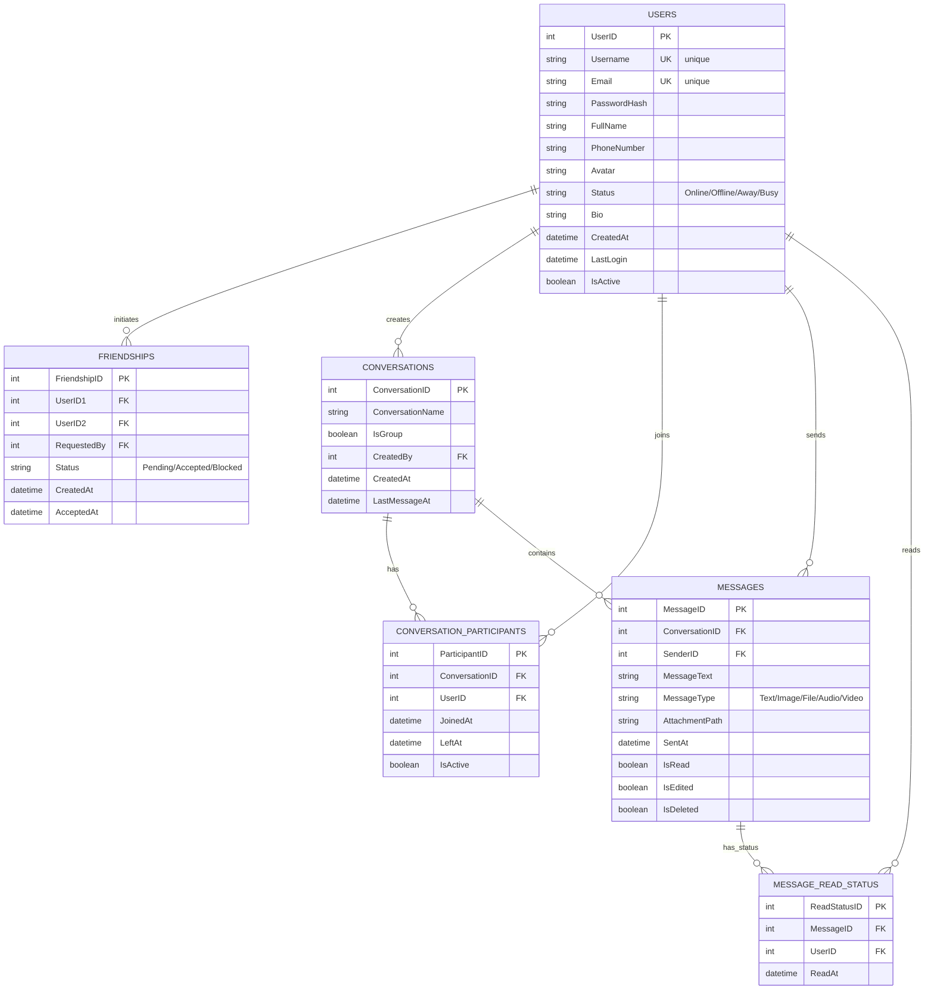

# ER Diagram - Messaging App Database

## Mermaid ER Diagram



---

## Cách Sử Dụng

### 1. **Xem trực tiếp trên GitHub**
- Commit file này lên GitHub
- Mermaid sẽ render tự động trong README hoặc file markdown

### 2. **Convert sang PNG/SVG**

#### Option A: Dùng Mermaid CLI
```bash
# Cài đặt
npm install -g @mermaid-js/mermaid-cli

# Convert sang PNG
mmdc -i DATABASE_ER_DIAGRAM.md -o database_diagram.png

# Convert sang SVG
mmdc -i DATABASE_ER_DIAGRAM.md -o database_diagram.svg -t dark
```

#### Option B: Dùng Online Editor
- Truy cập: https://mermaid.live/
- Copy nội dung diagram từ file này
- Paste vào editor
- Download PNG/SVG

#### Option C: Dùng VS Code Extension
- Cài đặt: "Markdown Preview Mermaid Support"
- Mở file markdown
- Preview sẽ hiển thị diagram

### 3. **Dùng Draw.io (Online)**
- Truy cập: https://draw.io/
- File → New → Database (ER Diagram)
- Vẽ lại sơ đồ hoặc import từ XML

### 4. **Dùng PlantUML (Nếu thích)**
- Tôi có thể tạo file `DATABASE_ER_DIAGRAM.puml`

---

## Các Tool Recommend

| Tool | Ưu Điểm | Nhược Điểm | Link |
|------|--------|-----------|------|
| **Mermaid** | Free, GitHub native, dễ sử dụng | Hạn chế styling | https://mermaid.live |
| **Draw.io** | Trực quan, drag-drop, đa định dạng | Cần tài khoản | https://draw.io |
| **PlantUML** | Mạnh mẽ, tùy chỉnh cao | Khó học | http://plantuml.com |
| **Lucidchart** | Professional, đẹp | Trả phí | https://lucidchart.com |
| **DBDiagram.io** | Chuyên database, SQL native | Free có hạn | https://dbdiagram.io |

---

## SQL Script để Tạo Bảng

Nếu muốn dùng script SQL, mở file [CreateDatabase.sql](MessagingApp/Database/CreateDatabase.sql)

---

## Gợi Ý

**Sử dụng DBDiagram.io sẽ tốt nhất vì:**
- ✅ Chuyên biệt cho ER Diagram
- ✅ Có thể export SQL, PNG, PDF
- ✅ Free version đủ dùng
- ✅ Collaboration support

**Cách dùng DBDiagram.io:**
1. Vào https://dbdiagram.io/
2. Click "Create New Diagram"
3. Paste code từ [DATABASE_DBDIAGRAM.sql](#sql-code-cho-dbdiagramio) dưới đây
4. Auto generate diagram

---

## SQL Code Cho DBDiagram.io

```sql
Table Users {
  UserID int [pk]
  Username varchar(50) [unique, not null]
  Email varchar(100) [unique, not null]
  PasswordHash varchar(255) [not null]
  FullName varchar(100)
  PhoneNumber varchar(20)
  Avatar varchar(255)
  Status varchar(50) [default: "Offline"]
  Bio varchar(500)
  CreatedAt datetime [default: "now()"]
  LastLogin datetime
  IsActive bit [default: 1]
}

Table Friendships {
  FriendshipID int [pk]
  UserID1 int [ref: > Users.UserID]
  UserID2 int [ref: > Users.UserID]
  RequestedBy int [ref: > Users.UserID]
  Status varchar(20) [default: "Pending"]
  CreatedAt datetime [default: "now()"]
  AcceptedAt datetime
}

Table Conversations {
  ConversationID int [pk]
  ConversationName varchar(100)
  IsGroup bit [default: 0]
  CreatedBy int [ref: > Users.UserID]
  CreatedAt datetime [default: "now()"]
  LastMessageAt datetime
}

Table ConversationParticipants {
  ParticipantID int [pk]
  ConversationID int [ref: > Conversations.ConversationID]
  UserID int [ref: > Users.UserID]
  JoinedAt datetime [default: "now()"]
  LeftAt datetime
  IsActive bit [default: 1]
}

Table Messages {
  MessageID int [pk]
  ConversationID int [ref: > Conversations.ConversationID]
  SenderID int [ref: > Users.UserID]
  MessageText varchar(max)
  MessageType varchar(20)
  AttachmentPath varchar(255)
  SentAt datetime [default: "now()"]
  IsRead bit [default: 0]
  IsEdited bit [default: 0]
  IsDeleted bit [default: 0]
}

Table MessageReadStatus {
  ReadStatusID int [pk]
  MessageID int [ref: > Messages.MessageID]
  UserID int [ref: > Users.UserID]
  ReadAt datetime [default: "now()"]
}
```

---

## Hướng Dẫn Chi Tiết

### ✅ Cách 1: Xem Mermaid trên GitHub (Đơn giản nhất)
```
1. Commit file DATABASE_ER_DIAGRAM.md lên GitHub
2. Mở file trên GitHub
3. Diagram sẽ render tự động
```

### ✅ Cách 2: Dùng DBDiagram.io (Tốt nhất)
```
1. Vào https://dbdiagram.io/
2. New Diagram
3. Copy SQL code ở trên
4. Paste vào editor
5. Auto generate diagram
6. Export PNG/PDF
```

### ✅ Cách 3: Dùng Mermaid Live (Nhanh)
```
1. Vào https://mermaid.live/
2. Paste Mermaid code
3. Download PNG
```

---

## Lưu ý

- File này hỗ trợ render trên **GitHub, GitLab, Notion**
- Mermaid diagram sẽ tự động update nếu thay đổi file
- DBDiagram.io cho phép export SQL script
- Có thể share diagram link trực tiếp

Bạn muốn tôi tạo thêm file nào không? (PlantUML, Draw.io JSON, v.v.)
