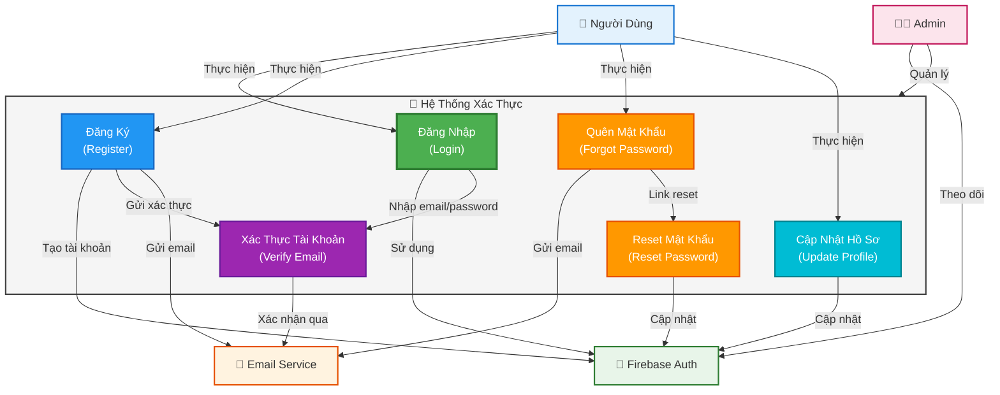
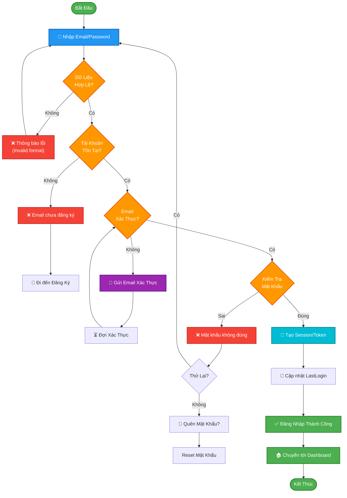
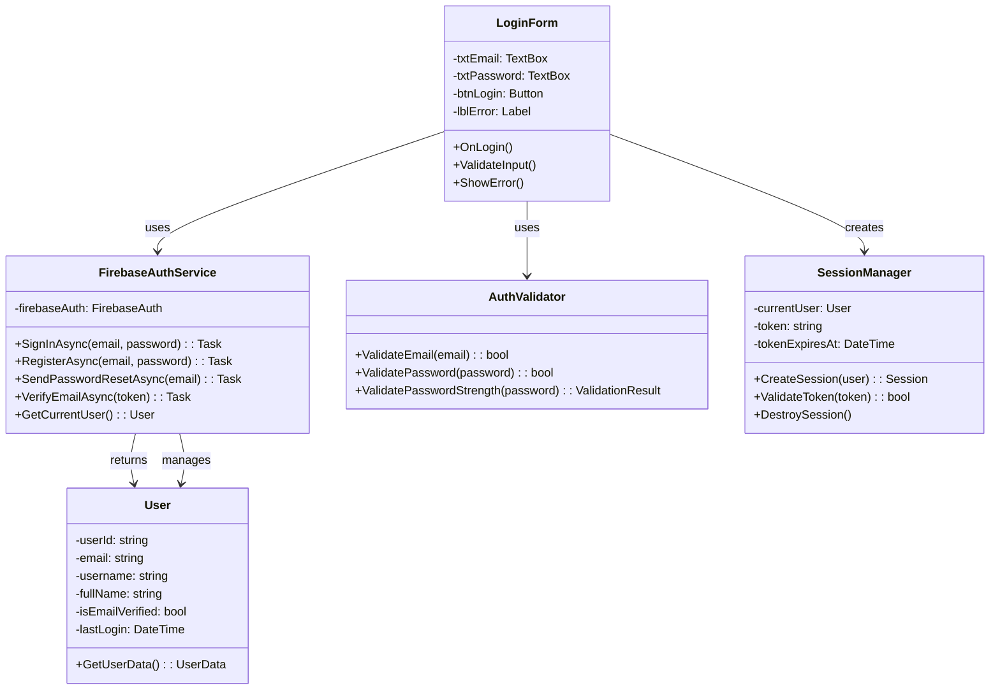

# Use Case Diagram - Login/Authentication System

## Mermaid Use Case Diagram



---

## Flow Diagram - Chi Tiết Quy Trình Đăng Nhập



---

## Use Case Specification - Chi Tiết Đăng Nhập

### UC1: Đăng Nhập (Login)

**Actors:**
- Primary: Người dùng (User)
- Secondary: Firebase Authentication Service

**Preconditions:**
- Người dùng chưa đăng nhập
- Tài khoản đã được đăng ký trước đó
- Email đã được xác thực

**Main Flow:**
1. Người dùng nhập email/username
2. Người dùng nhập mật khẩu
3. Hệ thống validate định dạng email
4. Hệ thống kiểm tra tài khoản tồn tại
5. Hệ thống xác thực mật khẩu qua Firebase
6. Hệ thống tạo session token
7. Cập nhật trường LastLogin
8. Chuyển hướng tới màn hình chính

**Alternative Flows:**

**A1: Email chưa đăng ký**
- 4a. Tài khoản không tồn tại
- 4b. Thông báo lỗi: "Email chưa đăng ký"
- 4c. Gợi ý: "Bạn muốn đăng ký không?"

**A2: Mật khẩu sai**
- 5a. Mật khẩu không khớp
- 5b. Thông báo lỗi: "Mật khẩu không đúng"
- 5c. Cho phép nhập lại (tối đa 3 lần)
- 5d. Sau 3 lần sai → Khóa tài khoản 15 phút

**A3: Email chưa xác thực**
- 3a. Email chưa xác thực
- 3b. Gửi lại email xác thực
- 3c. Đợi xác thực hoặc logout

**Postconditions:**
- Người dùng đăng nhập thành công
- Session token được tạo
- Có thể truy cập các tính năng của ứng dụng

**Exceptions:**
- Firebase service không hoạt động
- Kết nối internet bị mất
- Tài khoản bị khóa/ban

---

### UC2: Đăng Ký (Register)

**Main Flow:**
1. Người dùng nhập email
2. Người dùng đặt mật khẩu (min 8 ký tự)
3. Nhập lại mật khẩu để xác nhận
4. Nhập thông tin cá nhân (tên, điện thoại)
5. Đồng ý điều khoản
6. Hệ thống tạo tài khoản qua Firebase
7. Gửi email xác thực
8. Chuyển hướng tới màn hình xác thực email

---

### UC3: Quên Mật Khẩu (Forgot Password)

**Main Flow:**
1. Người dùng nhập email
2. Hệ thống kiểm tra tài khoản tồn tại
3. Gửi email reset password
4. Người dùng click link trong email
5. Nhập mật khẩu mới
6. Hệ thống cập nhật mật khẩu qua Firebase
7. Thông báo thành công
8. Chuyển hướng tới màn hình đăng nhập

---

## Activity Diagram - Quy Trình Đăng Nhập Chi Tiết

```mermaid
stateDiagram-v2
    [*] --> InputCredentials: Mở LoginForm
    
    InputCredentials --> ValidateFormat: Nhập Email/Password
    ValidateFormat --> FormatValid{Format<br/>Hợp Lệ?}
    
    FormatValid -->|Không| ShowError1: Thông báo lỗi format
    ShowError1 --> InputCredentials
    
    FormatValid -->|Có| CheckAccount: Kiểm tra Email
    CheckAccount --> AccountExists{Account<br/>Tồn Tại?}
    
    AccountExists -->|Không| ShowError2: Email chưa đăng ký
    ShowError2 --> SuggestRegister: Gợi ý đăng ký
    SuggestRegister --> InputCredentials
    
    AccountExists -->|Có| CheckVerified: Kiểm tra xác thực
    CheckVerified --> EmailVerified{Email<br/>Verified?}
    
    EmailVerified -->|Không| SendVerifyEmail: Gửi email xác thực
    SendVerifyEmail --> WaitVerify: Chờ xác thực
    WaitVerify --> EmailVerified
    
    EmailVerified -->|Có| AuthPassword: Xác thực mật khẩu
    AuthPassword --> PasswordValid{Password<br/>Đúng?}
    
    PasswordValid -->|Sai| IncAttempt: Tăng lần nhập sai
    IncAttempt --> AttemptsOk{< 3 lần?}
    
    AttemptsOk -->|Có| ShowError3: Thông báo lỗi
    ShowError3 --> InputCredentials
    
    AttemptsOk -->|Không| LockAccount: Khóa tài khoản 15min
    LockAccount --> ShowLocked: Thông báo khóa
    ShowLocked --> [*]
    
    PasswordValid -->|Đúng| CreateSession: Tạo Session Token
    CreateSession --> UpdateLastLogin: Cập nhật LastLogin
    UpdateLastLogin --> LoginSuccess: ✅ Đăng nhập thành công
    LoginSuccess --> NavigateApp: Chuyển tới App
    NavigateApp --> [*]
```

---

## Class Diagram - Lớp Đăng Nhập



---

## Mô Tả Chi Tiết Các Bước

| Bước | Thao Tác | Hệ Thống | Kết Quả |
|------|----------|----------|--------|
| 1 | Người dùng nhập email | LoginForm nhận input | Input được lưu |
| 2 | Người dùng nhập password | LoginForm nhận input | Input được lưu |
| 3 | Click "Đăng Nhập" | Validate format | Kiểm tra format email/password |
| 4 | Format hợp lệ | Check Firebase | Kiểm tra tài khoản tồn tại |
| 5 | Tài khoản tồn tại | Check email verified | Kiểm tra email đã xác thực |
| 6 | Email verified | Authenticate password | Xác thực mật khẩu qua Firebase |
| 7 | Password đúng | Create session | Tạo token, session |
| 8 | Session created | Update database | Cập nhật LastLogin |
| 9 | Update success | Navigate app | Chuyển tới màn hình chính |

---

## Security Measures - Biện Pháp Bảo Mật

✅ **Password Hashing**
- Sử dụng Firebase Authentication (bcrypt)
- Mật khẩu không lưu trực tiếp

✅ **Email Verification**
- Xác thực email trước đăng nhập
- Ngăn chặn bot/fake account

✅ **Account Lockout**
- Khóa tài khoản sau 3 lần nhập sai
- Thời gian khóa: 15 phút

✅ **SSL/TLS Encryption**
- Tất cả giao tiếp qua HTTPS
- Firebase handles encryption

✅ **Session Management**
- Token expire sau 24h
- Refresh token mechanism

✅ **Rate Limiting**
- Giới hạn login attempts
- Ngăn brute force attacks

---

## Testing Scenarios

### ✅ Test Case 1: Login Thành Công
```
Input: 
  - Email: user@example.com
  - Password: ValidPassword123
Expected Output:
  - ✅ Session created
  - ✅ Redirect to main app
  - ✅ LastLogin updated
```

### ❌ Test Case 2: Email Không Tồn Tại
```
Input:
  - Email: nonexistent@example.com
  - Password: SomePassword123
Expected Output:
  - ❌ "Email chưa đăng ký"
  - Gợi ý: Đăng ký tài khoản
```

### ❌ Test Case 3: Mật Khẩu Sai (3 lần)
```
Input:
  - Email: user@example.com
  - Password: WrongPassword (3 times)
Expected Output:
  - ❌ "Tài khoản bị khóa 15 phút"
```

### ⚠️ Test Case 4: Email Chưa Xác Thực
```
Input:
  - Email: user@example.com (unverified)
  - Password: CorrectPassword
Expected Output:
  - ⚠️ "Email chưa xác thực"
  - Gửi email xác thực lại
```
